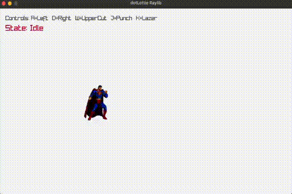

# dotLottie-raylib

Tiny glue that lets Raylib render `.lottie` archives or raw Lottie JSON as textures you can play, pause, seek by markers, and tint like any other sprite. Drop in `dlrl.c` / `dlrl.h`, link against dotlottie_player + raylib, and drive it from your game loop.



## Requirements
- Raylib 5.x and a C compiler (Clang or GCC). Prebuilt raylib binaries/headers live in `third_party/raylib` for macOS (arm64) and Linux (x86_64); the Makefile links against them by default. Bring your own raylib for other OS/arch layouts.
- dotLottie runtime: `third_party/dotlottie_player` includes headers and test prebuilts for macOS (arm64) and Linux (x86_64/arm64). For Android, iOS, Windows, or other platforms, grab the prebuilts from the dotlottie_player releases and drop them into the same `lib/<os>/<arch>` layout.
- Assets: `.lottie` bundles alongside the executable (e.g., `super-man.lottie`). Avoid committing bulky test assets.

## Quick Start
```sh
make build                # builds dlrl + sample into build/example
make run                  # runs with super-man.lottie
make run ASSET=foo.lottie # run any .lottie or .json
make clean                # wipe build/
```
Adjust `INCLUDES` / `LIB_DIRS` in the Makefile if you swap in your own raylib/dotLottie SDKs or install them outside the bundled layout.

## Prebuilts & Platforms
- Bundled raylib and dotLottie binaries are for local testing only. Replace them with the correct libraries from upstream releases for your target OS/arch (including Android/iOS), then rebuild with `make clean && make build`.
- The Makefile picks subdirectories of `third_party/dotlottie_player/lib/<os>/<arch>` and `third_party/raylib/lib/<os>/<arch>` based on your host. If nothing matches, it errors and points you at the releases.
- Raylib is looked up in `third_party/raylib/lib/<os>/<arch>`; drop in the right build if you’re on a different platform.

## Using It in Your Project
1) Copy `dlrl.c` and `dlrl.h` into your project.
2) Add `third_party/dotlottie_player/include` and `third_party/raylib/include` to your compiler include paths; add the matching `third_party/dotlottie_player/lib/<os>/<arch>` and `third_party/raylib/lib/<os>/<arch>` to your linker search paths.
3) Link with `-ldotlottie_player -lraylib` plus platform libs (OpenGL/Cocoa on macOS, X11/GL/pthread on Linux).
4) Drive the player inside your Raylib loop:
```c
dlrl_Config cfg = {
    .loop = true, .speed = 1.0f,
    .fit = DLRL_FIT_CONTAIN, .align = (Vector2){0.5f, 0.5f},
    .background = BLANK
};
dlrl_Player* p = dlrl_LoadDotLottieFile("hero.lottie", &cfg);
dlrl_Play(p);
// in your frame:
dlrl_Update(p, GetFrameTime());
dlrl_Draw(p, (Rectangle){x, y, w, h}, 0.0f, WHITE);
```

## Playback Controls and Markers
- Switch animation/theme/state machine at runtime via `dlrl_SetAnimation`, `dlrl_SetTheme`, and `dlrl_SetMarker`.
- Enumerate markers with `dlrl_MarkerCount` / `dlrl_MarkerName`; the sample maps marker names to keys (`example.c`).
- `dlrl_SetMode` covers forward, reverse, bounce, and reverse-bounce; `dlrl_SetLoop` and `dlrl_SetSpeed` adjust looping and time scale.

## Troubleshooting
- Link errors about dotLottie: ensure the correct `third_party/dotlottie_player/lib/<os>/<arch>` exists for your CPU/OS and matches your compiler target.
- Blank render: call `dlrl_Update` every frame, pass a non-zero destination rectangle, and try `dlrl_SetMarker(p, NULL)` to play the full timeline.
